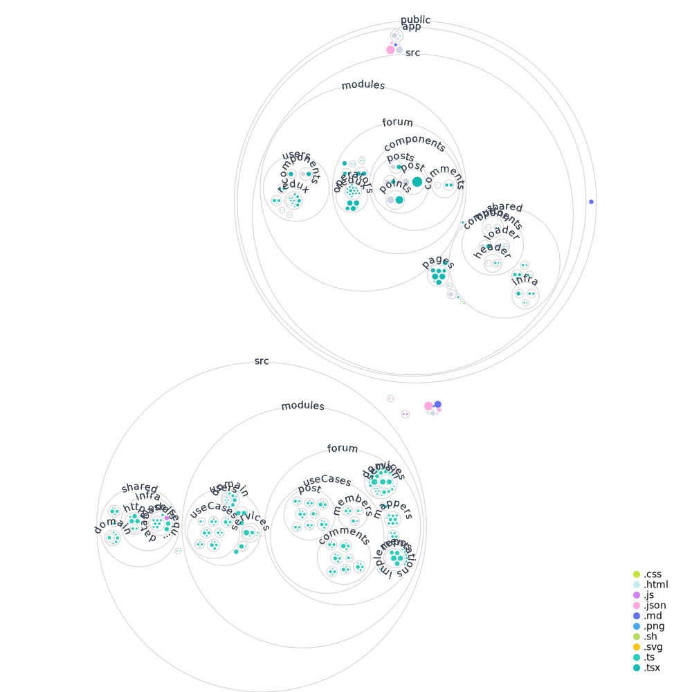

<p align="center">
 
</p>
<h1 align="center">DDDForum.com</h1>

<p align="center">
 <a href="https://circleci.com/gh/stemmlerjs/ddd-forum"></a>
 <a href="#contributors"></a>
</p>

> A [SOLID](https://khalilstemmler.com/articles/solid-principles/solid-typescript/) hackernews-inspired forum site built with TypeScript using the [clean architecture](https://khalilstemmler.com/articles/software-design-architecture/organizing-app-logic/) and [DDD best practices](https://khalilstemmler.com/articles/domain-driven-design-intro/).


## About 

DDDForum.com is the application that we build in [solidbook.io - The Software Design and Architecture Handbook](https://solidbook.io). 

## Running the project

You can run the project using [Docker](https://docs.docker.com/compose/gettingstarted/). First, copy `.env` template file. Feel free to change passwords and app secrets. 

```bash
cp .env.template .env
```

Then build and run the image.

```bash
docker-compose up
```

You can visit the app by going to `http://localhost:3000`.

### Demo 

[You can visit the site here](https://dddforum.com).

> `Note`: It's currently deployed on free tier Heroku, which has some undesirable side-effects like shutting off the server during periods of inactivity. So if it's down for you, refresh a couple of times. Thinking about migrating this to a serverless architecture later on.

### Built with

#### Backend

- [Sequelize](https://github.com/sequelize/sequelize) - The ORM for Node.js
- [Express.js](https://expressjs.com/) - Lightweight webserver
- [Redis](https://redis.io/) - For holding onto JWT tokens and refresh tokens

#### Frontend

- [React.js](https://reactjs.org/)
- [Redux](https://redux.js.org/)
- [Sass](https://sass-lang.com/)

### Architecture

We built this based on the [Clean Architecture](https://khalilstemmler.com/articles/software-design-architecture/organizing-app-logic/), [SOLID principles](https://khalilstemmler.com/articles/solid-principles/solid-typescript/), and [Domain-Driven Design](https://khalilstemmler.com/articles/domain-driven-design-intro/) best practices using TypeScript.

#### Clean architecture

There's obviously a lot that went into building this from front to back.

The **Clean Architecture** is a way to reason about where different types of application logic belongs. 


There's a lot more to learn about the clean architecture, but for now- just know that it's a way to really separate the concerns of everything that goes into building complex enterprise applications. You'll never see any `infrastructure`-related code alongside `domain` layer code.

The clean architecture, when combined with Domain-Driven Design, is very powerful :) 

In DDD, we build applications on top of a number of subdomains.

##### Subdomains

> A _subdomain_ is a cohesive unit of code that represents exactly one core concept and is responsible for a specific set of concerns in an application architecture. For example, every appliciation has a `users` subdomain. That's responsible for _users, identity & access management, authentication, authorization, etc_. Sometimes you don't want to build that yourself. Sometimes you can go with an off-the-shelf solution like [Auth0](https://auth0.com/). But there are subdomains in your application that you cannot simply outsource. These are the **family jewels**; the thing that's actually _novel_ about your app. This is the subdomain that no one (except you) can code. Know why? Because only _you_ have the domain knowledge to build it exactly the way that it should be built. You understand the domain. 

In DDDForum, we have 2 **subdomains**: The `users` subdomain and the `forum` subdomain.


Each subdomain has a:

- `domain` layer: where the highest-level policy, domain objects, and domain rules belong (`user`, `email`, etc)
- `application` layer: where the use cases / features that utilize domain objects belong (`createUser`, `login`, etc)
- `adapter` layer: where we define abstractions so that `application` layer code can interact with `infrastructure` layer concepts, without actually requiring on `infrastructure` (because that would break the [dependency rule](https://khalilstemmler.com/wiki/dependency-rule/)). Here we write things like `IUserRepo` - repository adapter, `IJWTTokenService` - an abstraction of a cache (redis) that manages tokens, etc.
- `infrastructure` layer: where we create [concrete](https://khalilstemmler.com/wiki/concrete-class/) implementations of the abstractions from the `adapter` layer so that they can be spun up at runtime thanks to the power of polymorhpism :) (more on this later).

> If you haven't already, I recommend you read [this article](https://khalilstemmler.com/articles/enterprise-typescript-nodejs/application-layer-use-cases/) on use cases and subdomains.

Let's identify some of the actual concepts that exist in each subdomain.

### `users` subdomain

In the` users` subdomain, we're only concerned with concepts that are related to authentication, roles, etc. Here are a few examples of classes and concepts that exist at each layer.

- `domain` layer: `user` ([aggregate root](https://khalilstemmler.com/articles/typescript-domain-driven-design/aggregate-design-persistence/)), `userEmail` ([value object](https://khalilstemmler.com/articles/typescript-value-object/)), `userCreated` ([domain event](https://khalilstemmler.com/articles/typescript-domain-driven-design/chain-business-logic-domain-events/)).
- `application` layer: `createUserUseCase` ([use case](https://khalilstemmler.com/articles/enterprise-typescript-nodejs/application-layer-use-cases/)), `getUserByUserName` (use case).
- `adapter` layer: `IUserRepo` ([respository](https://khalilstemmler.com/articles/typescript-domain-driven-design/repository-dto-mapper/) interface adapter)
- `infrastructure` layer: `SequelizeUserRepo` (a concrete implementation of the IUserRepo), `UserDTO` ([data transmission objects](https://khalilstemmler.com/articles/typescript-domain-driven-design/repository-dto-mapper/)).

### `forum` subdomain

In the `forum` subdomain, we're only concerned with concepts that have to do with building a forum. You won't see any domain concepts from the `user` in `forum`. In the `forum` subdomain, the concept most equivalent to a `user`, is a `member`.

Here are a few examples of concepts from the `forum` subdomain.

- `domain` layer: `member`, `comment`, `post`, `postVote`, `commentVote`, `commentVotesChanged`
- `application` layer: `replyToComment`, `getMemberByUserName`,  `upvotePost`, `downvotePost`
- `adapter` layer: `ICommentRepo`, `IPostRepo`, `IMemberRepo`
- `infrastructure` layer: `SequelizeCommentRepo`, `SequelizePostRepo`, `SequelizeMemberRepo`

## Project visualization

Here's a large-scale visualization of the repo. As I put more time into the front-end, it may change a little bit.



## Contributing

DDDForum is an open source project, and contributions of any kind are welcome! Open issues, bugs, and enhancements are all listed on the issues tab and labeled accordingly. Feel free to open bug tickets and make feature requests. Easy bugs and features will be tagged with the good first issue label.

## Contributors ✨

Thanks goes to these wonderful people ([emoji key](https://allcontributors.org/docs/en/emoji-key)):

<!-- ALL-CONTRIBUTORS-LIST:START - Do not remove or modify this section -->
<!-- prettier-ignore-start -->
<!-- markdownlint-disable -->
<table>
  <tr>
    <td align="center"><a href="https://linkedin.com/in/anthonydenneulin"><br /><sub><b>Anthony Denneulin</b></sub></a><br /><a href="https://github.com/stemmlerjs/ddd-forum/commits?author=denneulin" title="Code">💻</a></td>
    <td align="center"><a href="http://khalilstemmler.com/"><br /><sub><b>Khalil Stemmler</b></sub></a><br /><a href="https://github.com/stemmlerjs/ddd-forum/commits?author=stemmlerjs" title="Code">💻</a> <a href="https://github.com/stemmlerjs/ddd-forum/issues?q=author%3Astemmlerjs" title="Bug reports">🐛</a> <a href="https://github.com/stemmlerjs/ddd-forum/commits?author=stemmlerjs" title="Documentation">📖</a> <a href="#infra-stemmlerjs" title="Infrastructure (Hosting, Build-Tools, etc)">🚇</a> <a href="#ideas-stemmlerjs" title="Ideas, Planning, & Feedback">🤔</a></td>
    <td align="center"><a href="https://medium.com/@faisol.chehumar"><br /><sub><b>Faisol Chehumar</b></sub></a><br /><a href="https://github.com/stemmlerjs/ddd-forum/commits?author=faisol-chehumar" title="Code">💻</a></td>
    <td align="center"><a href="https://trungtran.io/"><br /><sub><b>Trung Tran</b></sub></a><br /><a href="#infra-ChunML" title="Infrastructure (Hosting, Build-Tools, etc)">🚇</a></td>
  </tr>
</table>

<!-- markdownlint-enable -->
<!-- prettier-ignore-end -->
<!-- ALL-CONTRIBUTORS-LIST:END -->

This project follows the [all-contributors](https://github.com/all-contributors/all-contributors) specification. Contributions of any kind welcome!

## License

This project is licensed under the ISC License - see the [LICENSE.md](https://github.com/stemmlerjs/ddd-forum/blob/master/LICENCE.md) file for details
